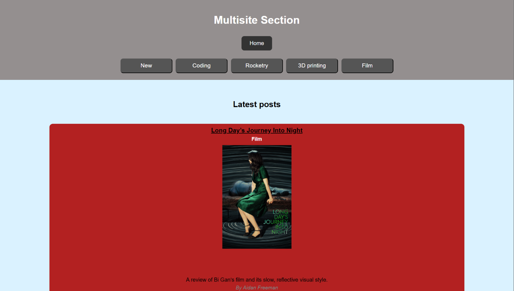
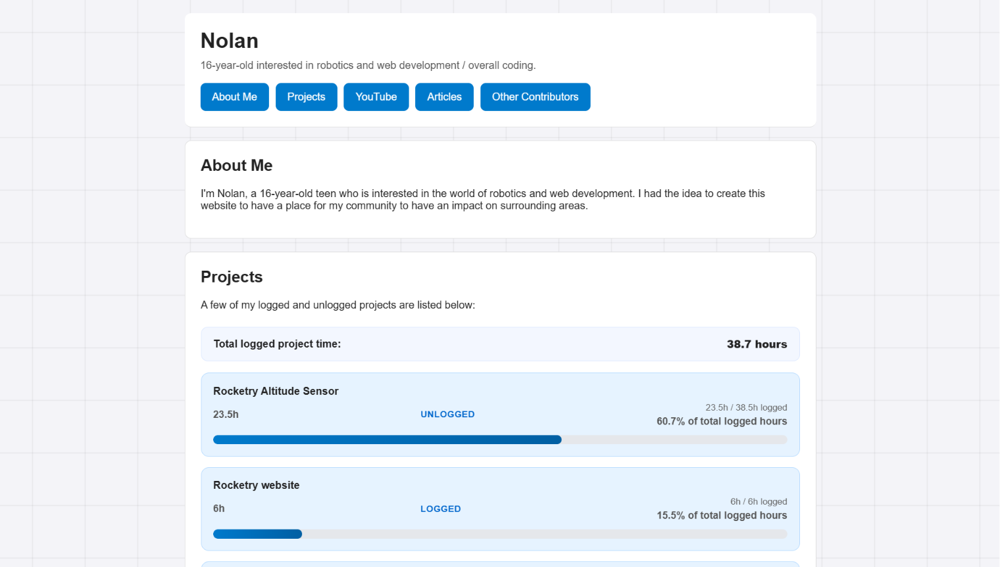
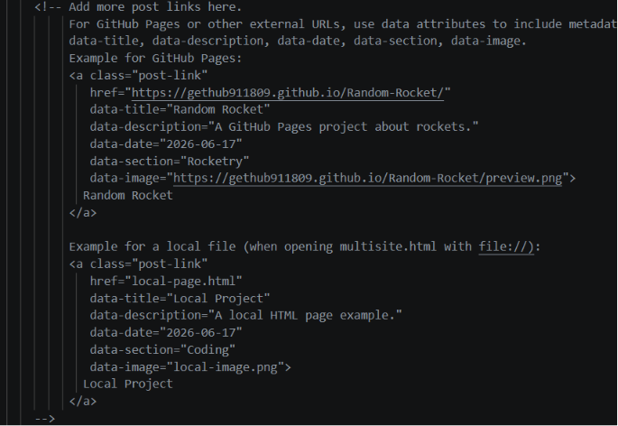

# Multisite
The is a website that is for my community to post upates and cool information about STEM related things and subjects that we find interesting. It will include 4 sections which are Rocketry, Coding, 3D printing, and film. I hope to provide a place for both me and my friends a place to share cool things we are doing with each other.

There will also be portfolios for each contributor showcasing what they have been up to along with some information, including things like social media, descriptions, etc.

# How To Use

To run this website you can visit the website [here](https://gethub911809.github.io/Multisite/)

You will first see a page that shows two options being multisite, and contributors. The multisite button will lead you to the homepage with the 3 newest updates within the community.

And the contributors page will lead you to a list of contributors which will have their own dedicated pages.

# Adding to this page

To add to this page there are comments explaining the requirements in the multisite.html file. You can create a separate page and add the according meta data and then send a push request. You can also create a new folder in the documents folder and create your own html file and then link to the html file in multisite.html file. There are multiple examples on how to upload your page within the multisite.html file.

